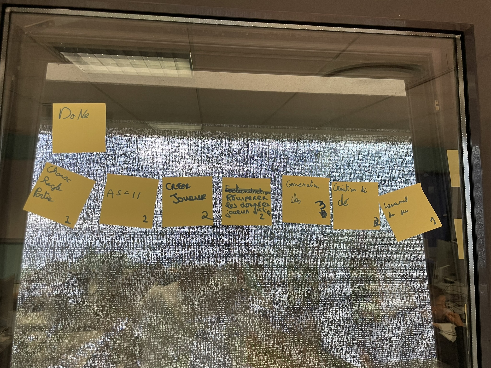
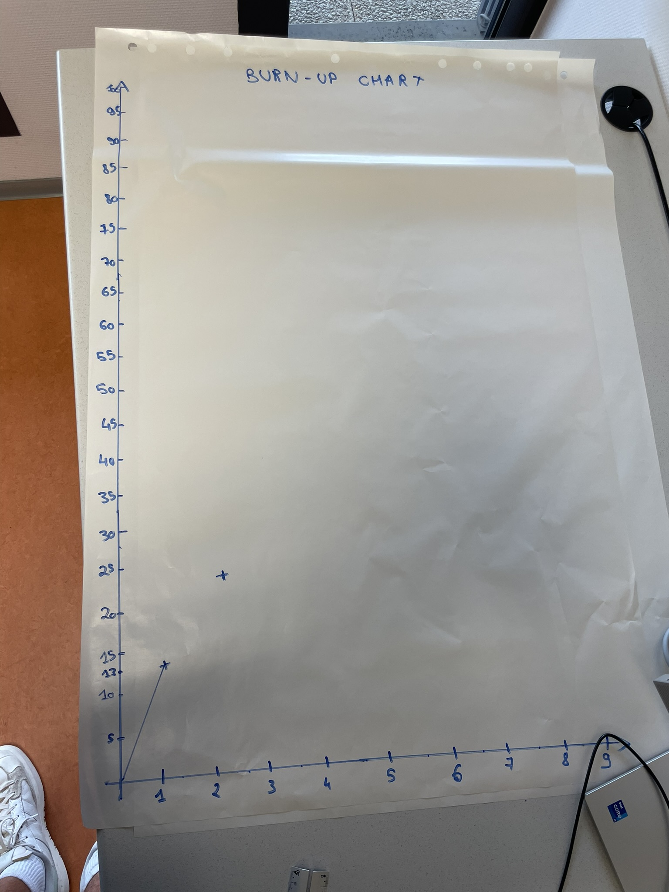

# Premier sprint

## Démonstration et planification du prochain sprint

### Tâches réalisées durant ce sprint

Les histoires utilisateurs livrées durant ce sprint sont : 

- Le choix des différentes règles des parties
- Création d'éléments visuels au format ASCII
- Importer un joueur à une partie
- Récuperer les données d'un joueur dans un fichier
- Génération d'îles de taille et nombre aléatoire
- Création d'un dé
- Lancement du jeu

Nous avons oublié de tracer la courbe des valeurs totales de la backlog. Toutefois, nous avons collecter ces différentes valeurs et la courbe est tracée à partir du readme du sprint 5.

### Tâches que nous réaliserons au prochain sprint

Les histoires utilisateurs que nous nous engageons à réaliser au prochain sprint sont : 

- Déterminer les bonus à cacher sur les îles
- Déterminer les bonus récupérables à la possession d'une île
- Création d'un menu
- Récupérer les éléments visuels du dé
- Gérer l'ensemble des îles
- Ecriture des règles de jeu

## Rétrospective 

### Problèmes

- Temps
- Conflits de branche

### Indicateurs

- Problème de branches lors de pull/push

### Solutions

- Prendre moins de tâches