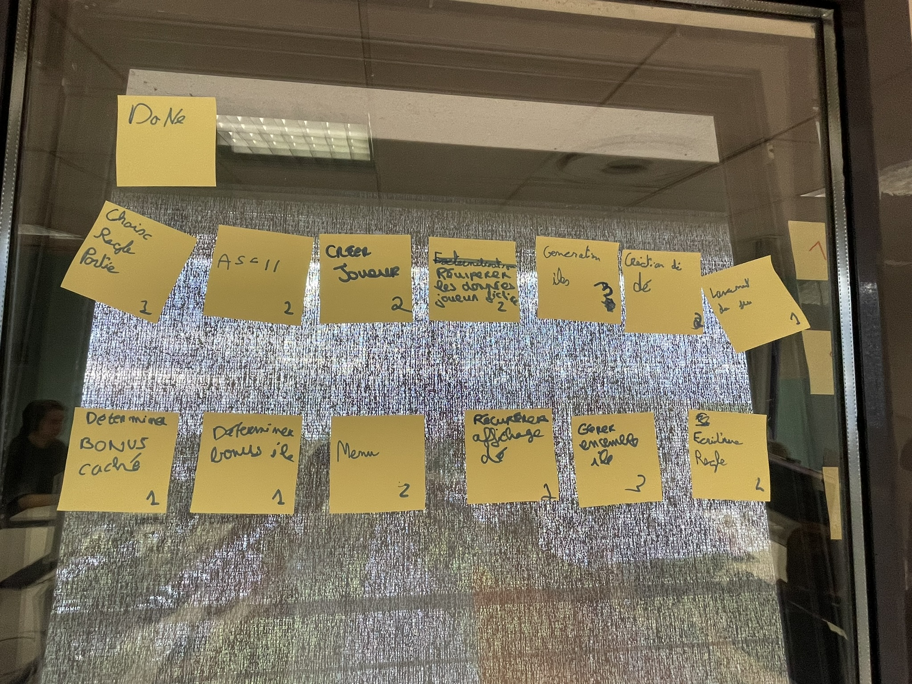
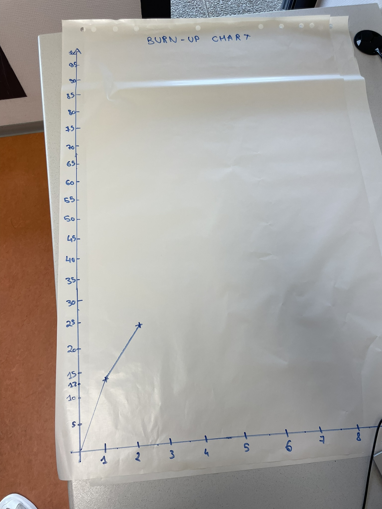

# Deuxième sprint

## Démonstration et planification du prochain sprint

### Tâches réalisées durant ce sprint

Les histoires utilisateurs livrées durant ce sprint sont : 

- Déterminer les bonus à cacher sur les îles
- Déterminer les bonus récupérables à la possession d'une île
- Création d'un menu
- Récupérer les éléments visuels du dé
- Gérer l'ensemble des îles
- Ecriture des règles de jeu

Nous avons oublié de tracer la courbe des valeurs totales de la backlog. Toutefois, nous avons collecter ces différentes valeurs et la courbe est tracée à partir du readme du sprint 5.

### Tâches que nous réaliserons au prochain sprint

Les histoires utilisateurs que nous nous engageons à réaliser au prochain sprint sont : 

- Gestion des tours de jeu
- Gestion de la propriété des iles
- Affichage de l'historique dans le menu
- Implémentation des bonus d'île
- Historisation

## Rétrospective 

### Problèmes

- Problèmes de versions (Git)

### Indicateurs

- Problème de branches lors de pull

### Solutions

- Résolution des fichiers modifiés