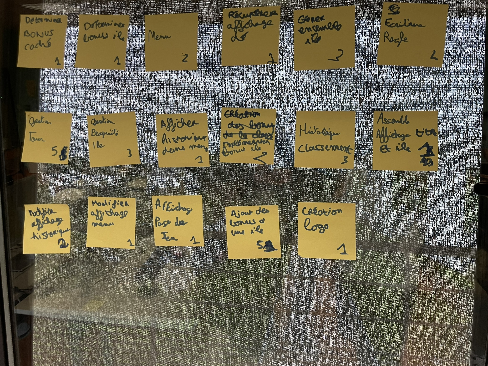
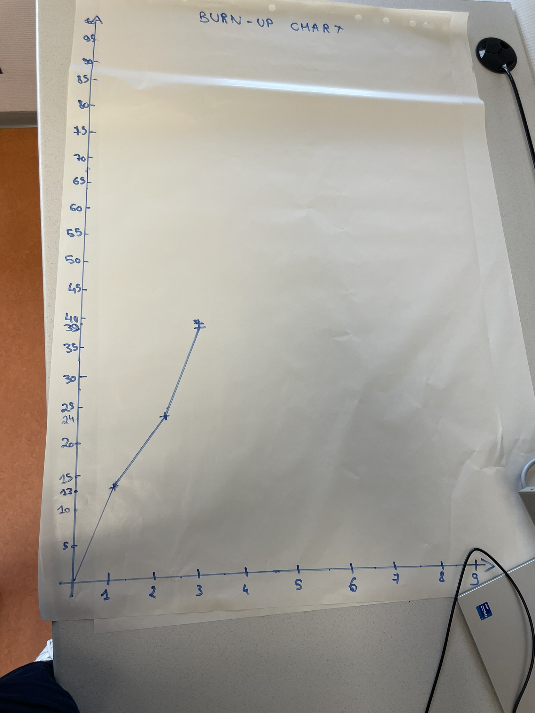

# Troisième sprint

## Démonstration et planification du prochain sprint

### Tâches réalisées durant ce sprint

Les histoires utilisateurs livrées durant ce sprint sont : 

- Gestion des tours de jeu
- Gestion de la propriété des iles
- Affichage de l'historique dans le menu
- Implémentation des bonus d'île
- Historisation

Nous avons oublié de tracer la courbe des valeurs totales de la backlog. Toutefois, nous avons collecter ces différentes valeurs et la courbe est tracée à partir du readme du sprint 5.

### Tâches que nous réaliserons au prochain sprint

Les histoires utilisateurs que nous nous engageons à réaliser au prochain sprint sont : 

- Modifier l'affichage de l'historique
- Modifier l'affichage du menu
- Afficher la page de jeu
- Ajout des bonus aux îles
- Création du logo

## Rétrospective 

### Problèmes

- Problème de compilation de code lors de la démo
- Conflits de git

### Indicateurs

- Compilation non achevée lors de la démonstration
- Erreurs lors des pull

### Solutions

- Prendre un temps de répétition avant la démonstration
- Création de différentes branches dans GitLab