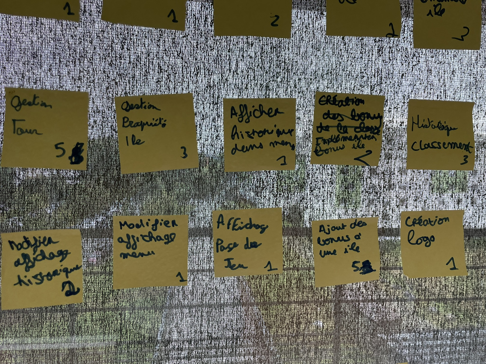
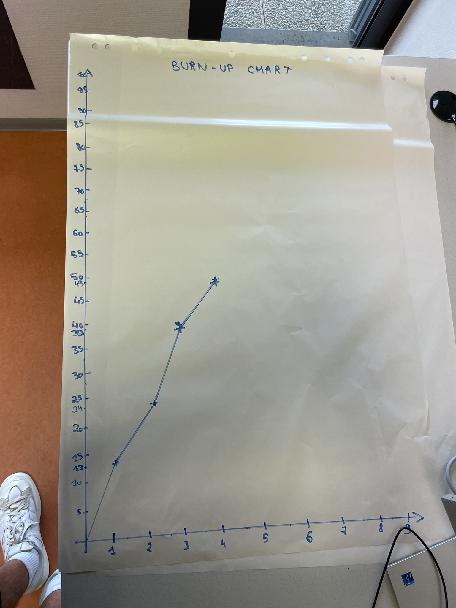

# Quatrième sprint

## Démonstration et planification du prochain sprint

### Tâches réalisées durant ce sprint

Les histoires utilisateurs livrées durant ce sprint sont : 

- Modifier l'affichage de l'historique
- Modifier l'affichage du menu
- Afficher la page de jeu
- Ajout des bonus aux îles
- Création du logo

Nous avons oublié de tracer la courbe des valeurs totales de la backlog. Toutefois, nous avons collecter ces différentes valeurs et la courbe est tracée à partir du readme du sprint 5.

### Tâches que nous réaliserons au prochain sprint

Les histoires utilisateurs que nous nous engageons à réaliser au prochain sprint sont : 

- Afficher les îles à l'horizontal
- Demander à l'utilisateur le bon nombre de joueurs
- Pouvoir attaquer des îles 
- Ajouter le dé à l'affichage de la partie
- Génération des bonus cachés sur l'île

## Rétrospective 

### Problèmes

Durant ce sprint, nous n'avons pas réellement rencontrer de problèmes.

### Indicateurs et solutions

Il n'y a donc aucun indicateur ni aucune solution à trouver.