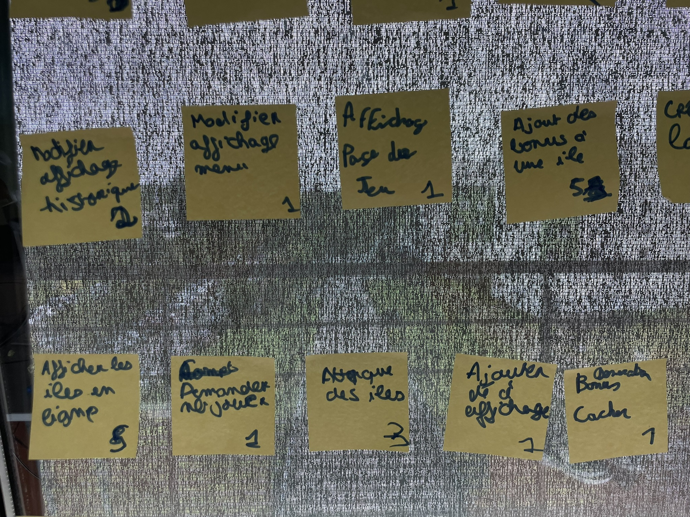
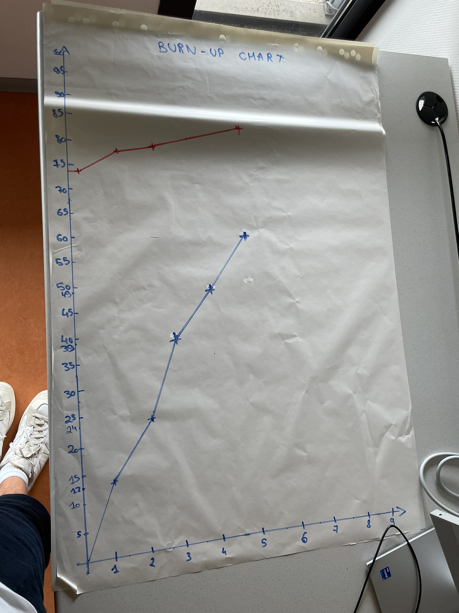

# Cinquième sprint

## Démonstration et planification du prochain sprint

### Tâches réalisées durant ce sprint

Les histoires utilisateurs livrées durant ce sprint sont : 

- Afficher les îles à l'horizontal
- Demander à l'utilisateur le bon nombre de joueurs
- Pouvoir attaquer des îles 
- Ajouter le dé à l'affichage de la partie
- Génération des bonus cachés sur l'île

### Tâches que nous réaliserons au prochain sprint

Les histoires utilisateurs que nous nous engageons à réaliser au prochain sprint sont : 

- Régler problèmes ile
- Ajouter l'affichage à la boucle de jeu
- Ajouter et supprimer des iles de la liste des îles possédées par un joueur
- Régler le problème de la boucle de jeu
- Ajouter bonus aux joueurs
- Faire en sorte que 2 joueurs ne peuvent pas avoir le même caractère
- Ajout des titres aux endroits manquants

## Rétrospective 

### Problèmes

Durant ce sprint, nous n'avons pas réellement rencontrer de problèmes.

### Indicateurs et solutions

Il n'y a donc aucun indicateur ni aucune solution à trouver.