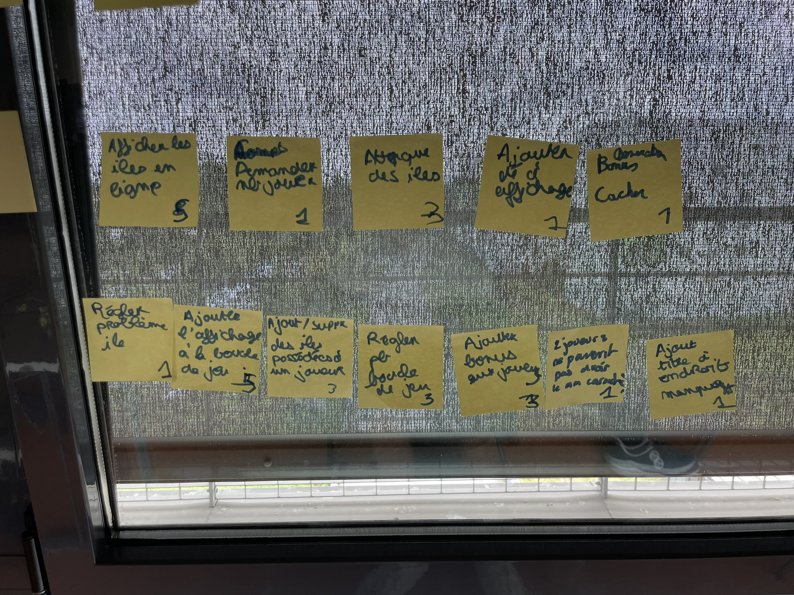
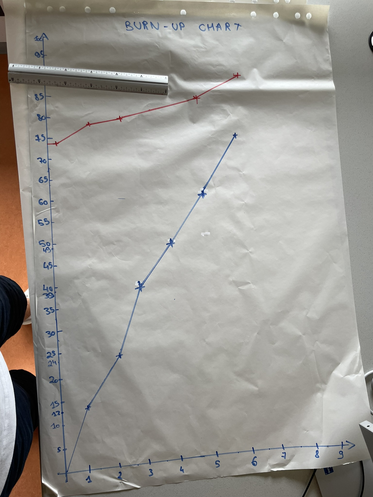

# Sixième sprint

## Démonstration et planification du prochain sprint

### Tâches réalisées durant ce sprint

- Régler problèmes ile
- Ajouter l'affichage à la boucle de jeu
- Ajouter et supprimer des iles de la liste des îles possédées par un joueur
- Régler le problème de la boucle de jeu
- Ajouter bonus aux joueurs
- Faire en sorte que 2 joueurs ne peuvent pas avoir le même caractère
- Ajout des titres aux endroits manquants

### Tâches que nous réaliserons au prochain sprint

Lors du prochain sprint, aucune histoire utilisateur ne sera achevée, notre attention étant portée à la résolution de bugs.

## Rétrospective 

### Problèmes

Durant ce sprint, nous avons rencontrer de nombreux bugs et comportements anormaux durant l'éxécution du jeu.

### Indicateurs 

Les différents indicateurs sont les différents affichages.

### Solutions

Des solutions au bugs seront trouvées lors du prochain sprint.  