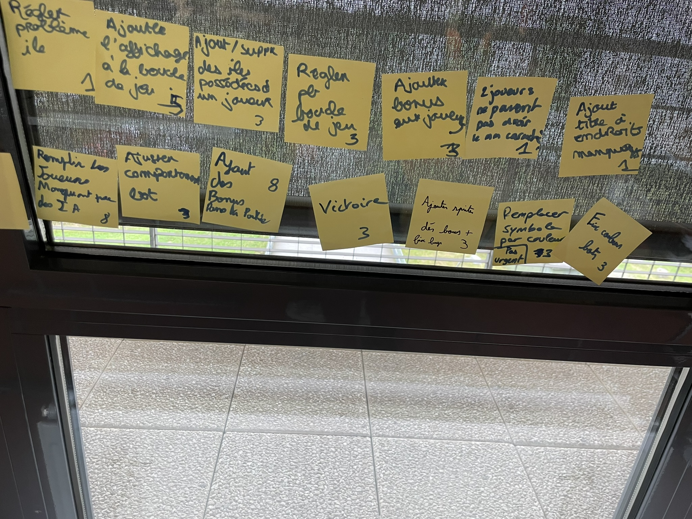
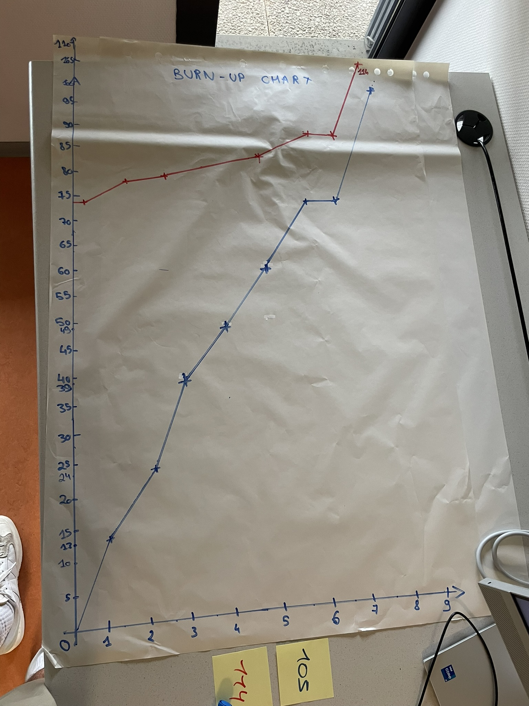

# Huitième sprint

## Démonstration et planification du prochain sprint

### Tâches réalisées durant ce sprint

Les histoires utilisateurs livrées durant ce sprint sont : 

- Remplir la partie en replaçant les joueurs manquants par des bots
- Ajuster le comportement des bots
- Ajout des bonus dans la partie
- Détéction de victoire
- Ajout du dé bonus
- Ajout de la colorisation
- Ajout d'une colorisation différente au bot

### Tâches que nous réaliserons au prochain sprint

Les histoires utilisateurs que nous nous engageons à réaliser au prochain sprint sont : 

- Ajout des trésors cachés à la partie
- Réajustement des règles
- Fix victoire wild

## Rétrospective 

### Problèmes

Durant ce sprint, nous n'avons pas réellement rencontrer de problèmes.

### Indicateurs et solutions

Il n'y a donc aucun indicateur ni aucune solution à trouver.